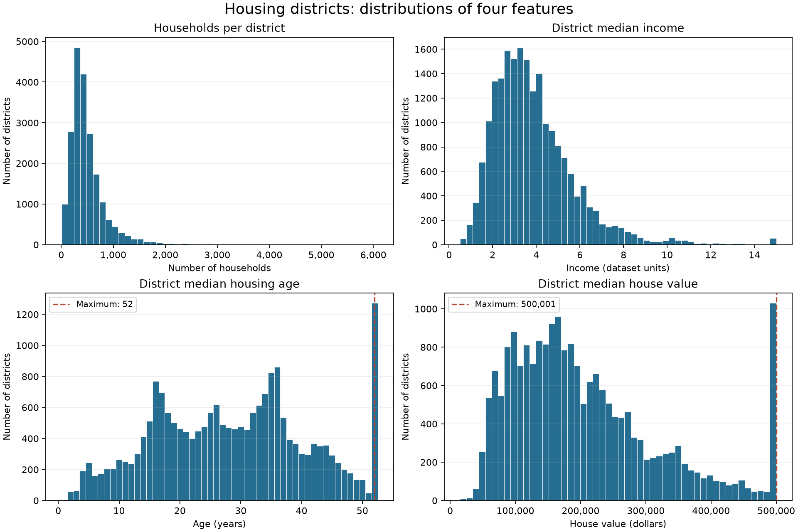

# Lab 1: Data and statistics

D0036E, Programming for Machine Learning, LTU. This repository contains runnable code, answers in the assignment's order, and teaching notes for each answer. All numerical results below were calculated from the supplied `housing.csv`; the copy in `data/raw/` matches the file beside the assignment PDF.

## Run the lab

Open a terminal in this repository. On Windows, use the existing environment:

```powershell
.\.venv\Scripts\python.exe -m pip install -r requirements.txt
.\.venv\Scripts\python.exe src/run_lab.py
.\.venv\Scripts\python.exe -m unittest discover -s tests -v
```

If starting from a fresh clone, create the environment first with `python -m venv .venv`. On Linux/macOS, substitute `.venv/bin/python` for `.\.venv\Scripts\python.exe`. Tested here with Python 3.14, pandas 3.0.5, and matplotlib 3.11.2.

The runner saves results to `outputs/`. The default input and output paths are relative to the repository, so running the script from another directory also works. Optional arguments: `--data path/to/housing.csv --output path/to/results`. Explicit relative arguments are relative to your terminal's working directory. Changing the data regenerates the outputs, but does not rewrite these explanatory answers.

| File | Purpose |
| --- | --- |
| `src/load_and_inspect.py` | Task 1: load and inspect; can also run on its own |
| `src/analysis.py` | Task 2: reusable functions, including our own mean, median, and correlation |
| `src/plots.py` | Four requested histograms |
| `src/run_lab.py` | Run the full analysis and save outputs |
| `tests/test_analysis.py` | Edge cases and independent comparisons against pandas |
| `outputs/summary.json` | Counts, overall mean, and extra observations |
| `outputs/category_values.csv` | Category value statistics |
| `outputs/category_profiles.csv` | Size, age, population, household, and income statistics |
| `outputs/endpoints.csv` | Counts at the age and value maxima |
| `outputs/histograms.png` | Plot for Questions 5 and 6 |

## Task 1: Load and inspect the housing data

### Answer and implementation

`load_housing()` uses `pd.read_csv()` and returns a DataFrame with **20,640 rows and 10 columns**. `inspect_housing()` displays the first 11 records, matching the example's row count, and prints the shape, column types, and missing-value counts. There are nine numeric columns and one categorical column. Only `total_bedrooms` has missing values: **207**.

```python
housing = load_housing()
inspect_housing(housing)
```

| Column | Meaning at the district level |
| --- | --- |
| `longitude`, `latitude` | Geographic coordinates |
| `housing_median_age` | Median age of housing in years |
| `total_rooms`, `total_bedrooms` | Total rooms and bedrooms across the district |
| `population` | District population |
| `households` | Number of households in the district |
| `median_income` | District median income, in the supplied dataset's encoded units |
| `median_house_value` | District median house value, interpreted in dollars |
| `ocean_proximity` | Category: `<1H OCEAN`, `INLAND`, `ISLAND`, `NEAR BAY`, `NEAR OCEAN` |

The supplied PDF/CSV does not provide a full data dictionary, collection date, or income-unit definition. Income comparisons below therefore retain the original units, and the values should not be presented as current market prices.

### For you as a student

A **DataFrame** is a table with named columns and indexed rows. `head()` previews rows, `shape` gives `(rows, columns)`, and `info()` describes types and non-missing counts. Loading is only the first step: inspection checks whether the data actually matches your assumptions.

Each row describes a **district**, not an individual house or person. This determines what we can conclude throughout the lab. Missing bedrooms mean "unknown", not zero bedrooms. The code leaves them missing and omits those observations only when calculating bedroom statistics.

The original script used `../data/raw/housing.csv`, which depends on where the terminal starts. `Path(__file__).resolve().parents[1]` finds the repository from the script's location. The `if __name__ == '__main__':` block runs inspection when you execute the file, but prevents it from running automatically when another file imports its functions.

## Task 2: Research questions

### 1. How many geographical units are there?

**Answer:** There are **20,640 district records**, **12,590 unique longitude/latitude pairs**, and **0 fully duplicated rows**. Taking "geographical units" to mean the housing districts described in the assignment, the answer is **20,640**. If it means distinct recorded coordinate pairs, the answer is **12,590**. The code reports both to make the interpretation explicit.

**Implementation:** `geographical_units()` uses `len(housing)` for districts and `drop_duplicates()` on the two coordinate columns for distinct pairs.

#### For you as a student

A location is not necessarily a unique identifier. Coordinates are recorded to limited precision, so separate district records can share them. For example, the preview has several rows at `(-122.25, 37.85)` with different housing information. Removing those rows would discard information. Before counting "unique things", decide exactly what the thing is.

### 2. What is the mean house value among all ocean-proximity categories?

**Answer:** The mean of all district median house values is **$206,855.82**.

**Implementation:** `overall_house_value()` calls our own `mean()` function on all 20,640 values:

```text
mean = sum of district median house values / number of districts
```

This is an equally weighted average of districts. It is not the mean price of every individual house, because individual house prices are not supplied.

#### For you as a student

For `[100, 200, 600]`, the mean is `(100 + 200 + 600) / 3 = 300`. Each observation gets one vote. Averaging the five category means equally would give the five island districts as much influence as the 9,136 `<1H OCEAN` districts. To recover the overall mean from category means, weight each by its district count:

```text
overall mean = sum(category mean * category count) / total count
```

### 3. What is the mean house value in each category?

**Answer:**

| Ocean proximity | Districts | Mean district median house value |
| --- | ---: | ---: |
| `<1H OCEAN` | 9,136 | $240,084.29 |
| `INLAND` | 6,551 | $124,805.39 |
| `ISLAND` | 5 | $380,440.00 |
| `NEAR BAY` | 2,290 | $259,212.31 |
| `NEAR OCEAN` | 2,658 | $249,433.98 |

`ISLAND` has the highest mean and `INLAND` the lowest. Among categories with many observations, `NEAR BAY` has the highest mean.

**Implementation:** `category_values()` iterates through `housing.groupby('ocean_proximity')` and applies our mean function to each group.

#### For you as a student

Grouping follows **split, apply, combine**: split the table by category, apply a calculation, then combine the results into a new table. Always include the number of observations alongside a mean. Five island records describe this sample but give much weaker support for broad generalizations than thousands of observations.

### 4. How do the mean and median values differ by category?

**Answer:** I interpret "values" here as `median_house_value`, following Questions 2 and 3.

| Ocean proximity | Mean | Median | Mean minus median |
| --- | ---: | ---: | ---: |
| `<1H OCEAN` | $240,084.29 | $214,850.00 | $25,234.29 |
| `INLAND` | $124,805.39 | $108,500.00 | $16,305.39 |
| `ISLAND` | $380,440.00 | $414,700.00 | -$34,260.00 |
| `NEAR BAY` | $259,212.31 | $233,800.00 | $25,412.31 |
| `NEAR OCEAN` | $249,433.98 | $229,450.00 | $19,983.98 |

The mean exceeds the median in four categories, consistent with high-value districts pulling up the average. In the tiny island group the mean is below the median; lower observations pull the mean down. Mean-versus-median differences alone do not fully describe a distribution's shape.

**Implementation:** `median()` sorts observations, selects the middle value for an odd count, and averages the two middle values for an even count. `category_values()` subtracts each group's median from its mean.

#### For you as a student

For `[100, 200, 600]`, the median is 200 and the mean is 300. Replacing 600 with 6,000 changes the mean dramatically but leaves the median unchanged. This is why medians are useful when extreme observations are present. Here we take the median **across district medians**; we cannot recover the median across all individual homes from those summaries.

### 5. Create histograms for the four requested features

**Answer:** `plot_histograms()` creates the following plots and saves them in `outputs/histograms.png`.



The household, income, and value plots use 50 bins. Housing age uses one bin per integer year so the final-year spike remains visible. All observations are included; no outliers are removed. The plots are saved without requiring a GUI window.

#### For you as a student

A histogram divides a numeric range into **bins** and counts observations in each bin. The horizontal axis shows the feature; the vertical axis counts districts. It does not show a timeline. Too few bins can hide structure; too many can make the plot noisy. Different bin choices can change the appearance without changing the data.

### 6. What do you notice, especially at the ends of the age and value graphs?

**Answer:**

- **Households:** Most districts have relatively few households, with a long right tail and a maximum of 6,082.
- **Median income:** The distribution is right-skewed: relatively few districts have very high encoded median incomes. The observed range is 0.4999 to 15.0001.
- **Housing median age:** Ages span 1 to 52 years. Exactly **1,273 districts (6.17%)** have the maximum age of 52, creating a final spike.
- **Median house value:** Values span **$14,999 to $500,001**, with a right tail and **965 districts (4.68%)** exactly at $500,001. The overall median is $179,700, below the mean of $206,855.82.

The abrupt endpoints and repeated exact maxima strongly suggest **top-coding/capping**: observations above a threshold may have been stored at the threshold. This is an inference from the supplied data, not a verified encoding rule from its metadata. We cannot recover the original values above a cap.

House values are on the scale of tens to hundreds of thousands of dollars. These large numbers reflect monetary units; a feature's numerical magnitude is not a measure of its predictive importance. They are historical/undated dataset values, not evidence of present-day prices.

**Implementation:** `endpoint_summary()` calculates maxima, exact counts, and percentages. The dashed lines mark the maxima in the histograms.

#### For you as a student

Capping differs from an ordinary outlier. If all ages above 52 are recorded as 52, "52" may mean "52 or older". A model trained on capped prices cannot learn the true differences between expensive properties beyond the cap. Inspect these patterns before modeling. For a later ML task, scaling may help algorithms sensitive to numeric magnitude, but fit any scaler on training data only. Scaling does not repair capped values.

### 7. Where are the most/least expensive and largest/smallest houses typically located?

**Answer:** "Expensive" is measured by category mean of `median_house_value`. Actual house size is unavailable, so I use **district rooms per household** as a rough size proxy and compare both its mean and median.

| Ocean proximity | Mean house value | Mean rooms/household | Median rooms/household |
| --- | ---: | ---: | ---: |
| `<1H OCEAN` | $240,084.29 | 5.153 | 5.059 |
| `INLAND` | $124,805.39 | 5.977 | 5.488 |
| `ISLAND` | $380,440.00 | 5.657 | 5.473 |
| `NEAR BAY` | $259,212.31 | 5.222 | 5.066 |
| `NEAR OCEAN` | $249,433.98 | 5.206 | 5.108 |

- **Most expensive:** `ISLAND`; **least expensive:** `INLAND`. Using category medians gives the same price extremes.
- **Largest by mean or median district rooms/household:** `INLAND`.
- **Smallest by those same proxies:** `<1H OCEAN`.

There is no single category that is both most expensive and largest under these definitions. Inland districts have lower values but more rooms per household. Price alone does not determine size.

**Implementation:** `add_ratios()` calculates `total_rooms / households` per district. `category_profiles()` summarizes the resulting ratios.

#### For you as a student

A district with 10,000 rooms and 2,000 households has 5 rooms per household; another with 1,000 rooms and 100 households has 10. Total rooms mainly reflects district scale, so it is unsuitable as a direct house-size measure.

Even rooms per household is imperfect: there is no floor area or dwelling count, and vacancies or unusual household counts can affect the ratio. "Typical" also needs a definition. The **mean of district ratios** weights districts equally. The **ratio of category totals** weights by households and gives `ISLAND` about 5.693 versus `INLAND` 5.692, reversing their very close ranking. Both are exported; the answer above deliberately uses district means and medians. A result should always name its measurement and weighting.

### 8. What can you say about housing quality in each category?

**Answer:** These are indirect characteristics of housing, not direct quality ratings.

| Ocean proximity | Mean district median age (years) | Mean rooms/household | Mean bedrooms/household |
| --- | ---: | ---: | ---: |
| `<1H OCEAN` | 29.28 | 5.153 | 1.050 |
| `INLAND` | 24.27 | 5.977 | 1.187 |
| `ISLAND` | 42.40 | 5.657 | 1.522 |
| `NEAR BAY` | 37.73 | 5.222 | 1.053 |
| `NEAR OCEAN` | 29.35 | 5.206 | 1.074 |

`INLAND` has the youngest housing by average district median age and the most rooms per household by the district-average proxy. `ISLAND` has the oldest housing and most bedrooms per household on average, based on just five records. `NEAR BAY` also has relatively old housing. `<1H OCEAN` and `NEAR OCEAN` have similar average ages and room ratios.

The data does not contain maintenance, renovations, materials, energy efficiency, or condition. It cannot establish which category has the "best quality" houses. Age results may also be affected by the apparent cap.

**Implementation:** `category_profiles()` applies our mean and median functions to ages and derived ratios. Missing bedroom ratios are excluded from bedroom summaries only.

#### For you as a student

A **proxy** is an observable measure used to approximate something not directly measured. Age may relate to condition, but an old renovated home can be in better condition than a newer neglected one. Separate what you measured from what you inferred. Also, 29.28 here is the mean of district median ages, not the mean age of every building.

### 9. What can you say about the demographics in each category?

**Answer:** The table describes district-level population, household counts, and income. Income remains in dataset units.

| Ocean proximity | Mean district population | Mean district households | Mean district median income | Mean people/household | Median people/household |
| --- | ---: | ---: | ---: | ---: | ---: |
| `<1H OCEAN` | 1,520.29 | 517.74 | 4.231 | 3.052 | 2.938 |
| `INLAND` | 1,391.05 | 477.45 | 3.209 | 3.303 | 2.848 |
| `ISLAND` | 668.00 | 276.60 | 2.744 | 2.383 | 2.439 |
| `NEAR BAY` | 1,230.32 | 488.62 | 4.173 | 2.620 | 2.544 |
| `NEAR OCEAN` | 1,354.01 | 501.24 | 4.006 | 2.952 | 2.624 |

`<1H OCEAN` has the highest average district population, household count, and district median income. `NEAR BAY` is close in income. `INLAND` has lower income than the three large coastal categories. `ISLAND` has the smallest average population and lowest income measure, despite its highest house values; the five records warrant caution.

`INLAND` has the highest **mean** population/household ratio, but `<1H OCEAN` has the highest **median**. Extreme ratios can change the mean ranking. Population/households is an occupancy proxy, not necessarily a direct measure of family size.

**Implementation:** `category_profiles()` produces this table's statistics, as well as category totals and pooled ratios in the CSV.

#### For you as a student

A category's total population depends partly on how many districts it contains. Mean district population asks a different question from total population. Without district area, neither establishes population density.

Do not infer a particular person's income, ethnicity, age, education, or occupation from their district. Drawing individual conclusions from group averages is an **ecological fallacy**. Those demographic attributes are not provided here. Likewise, the average of district median incomes is not the median income of everyone in that category.

### 10. Other interesting observations and research questions

**Answer:**

| Observation calculated from this dataset | Interpretation and follow-up question |
| --- | --- |
| Pearson correlation between district median income and house value is **0.6881** | There is a substantial positive linear association. Does it remain within each location category or after accounting for geography? |
| **207 missing bedroom values (1.003%)** | Check whether missingness varies by category or value range before choosing an imputation method. |
| Category counts range from **5 to 9,136** districts | Conclusions about islands are much less stable. Would the ranking persist with more island observations? |
| Maximum rooms/household is **141.91** | Investigate vacancy, seasonal properties, tiny denominators, or recording issues before interpreting this as an enormous home. |
| Maximum population/household is **1,243.33** | This is an unusual district ratio. Could group quarters or a data issue explain it? The CSV alone cannot decide. |
| High values occur in several coastal categories, while inland room ratios are larger | How much of the price difference is associated with income, location, or housing characteristics? |

These follow-up questions are proposals for further investigation; the repository does not claim they have already been answered. The apparent caps are another issue to investigate before training a regression model.

**Implementation:** `additional_observations()` reports missingness, ratio maxima, and our own `pearson_correlation()` result. Category counts and endpoint statistics come from the earlier functions.

#### For you as a student

Pearson correlation measures linear association, ranging from -1 to +1. Our implementation subtracts each variable's mean, sums products of paired deviations, then divides by the square root of the product of the two sums of squared deviations. A value near +1 means the two variables tend to increase together; zero means no linear association, not necessarily no relationship.

Correlation is not causation. This analysis does not prove that increasing income causes a specific increase in house prices, or that proximity to the ocean causes higher values. Other factors can influence both. Also, **0.6881 is not 68.81% prediction accuracy**.

A good investigation moves from a measured pattern to a testable question. For example: "Within each proximity category, is the income/value association still positive?" That is more precise than "Does income matter?"

## How to study the implementation

Read `load_and_inspect.py`, then `mean()` and `median()` in `analysis.py`. Work through each function with three or four invented numbers before following the full dataset through it. Continue with `category_values()`, then `add_ratios()` and `category_profiles()`. Finally read `plots.py` and the runner.

The tests check odd/even medians, missing values, undefined statistics, paired correlation, preservation of the raw data, and agreement with independent pandas calculations on the real dataset. This lets you learn the algorithms explicitly while using a separate implementation to catch mistakes.

Try explaining these three points in your own words: why districts can share coordinates, why a mean of medians is not an individual-house mean, and why total rooms alone cannot measure house size.
